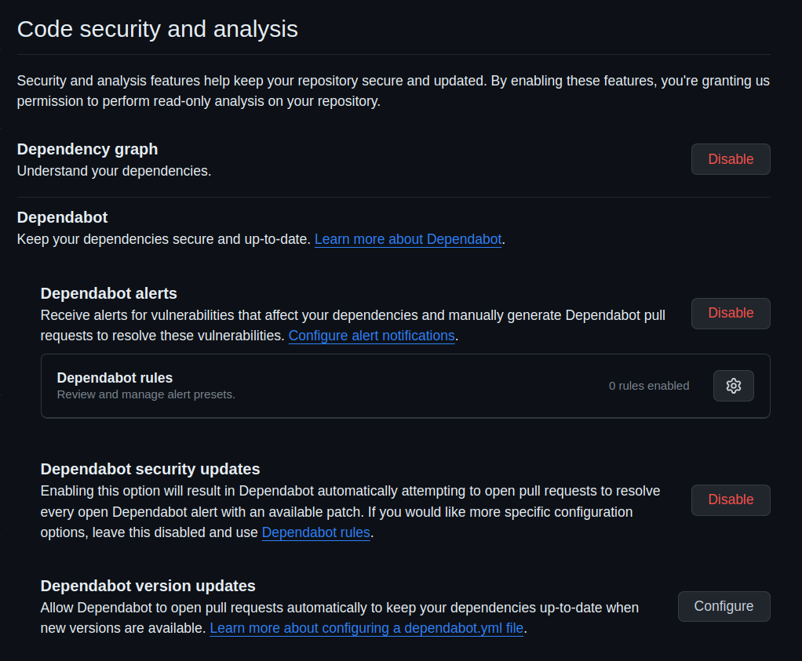

# alexandria-web-service

## How to run this application

### Gradle program

- **Linux/Mac**: `gradlew`
- **Windows**: `gradlew.bat`

### Common part (Linux/Mac assumed)

1. Clone the project [alexandria-infrastructure](https://github.com/code-sherpas/alexandria-infrastructure)

#### Follow this section if you DON'T NEED to create a new database migration.

1. Authenticate yourself to be able to download Docker images from the GitHub Container Registry by following [this GitHub guide](https://docs.github.com/en/packages/working-with-a-github-packages-registry/working-with-the-container-registry#authenticating-with-a-personal-access-token-classic).
   1. Login step is needed only once. 
2. Run `docker-compose up` (at 2025-04-23 it runs a PostgreSQL Docker container and infrastructure container (See [Infrastructure Dockerfile](https://github.com/code-sherpas/alexandria-infrastructure/blob/main/Dockerfile)). See [`docker-compose.yaml`](docker-compose.yaml). Run `docker-compose down` to stop it.)

#### Follow this section if you NEED to create a new database migration. Read next section otherwise.

Go the alexandria-infrastructure project [README.md](https://github.com/code-sherpas/alexandria-infrastructure/blob/main/README.md) and run the database migrations.

### Option 1. Run it through Gradle build tool (Linux/Mac assumed)

`./gradlew bootRun` (typically you can terminate the program pressing [`ctrl+C`](https://en.wikipedia.org/wiki/Control-C))

### Option 2. Run it through an IDE

- **IntelliJ**: navigate to [`spring-boot/src/main/kotlin/tcla/TclaWebService.kt`](spring-boot/src/main/kotlin/tcla/TclaWebService.kt) and click to run the function `fun main(args: Array<String>)` (you can terminate the program pressing the red stop button)
- (feel free to contribute adding more IDE guides)

### Option 3. Run the JAR file (Linux/Mac assumed)

1. `./gradlew assemble` (generates the JAR file containing the application)
2. `java -jar spring-boot/build/libs/spring-boot.jar` (typically you can terminate the program pressing [`ctrl+C`](https://en.wikipedia.org/wiki/Control-C))

### Option 4. Run it as a Docker container (Linux/Mac assumed)

1. `./gradlew assemble` (generates the JAR file containing the application)
2. `docker build --build-arg JAR_FILE=spring-boot/build/libs/spring-boot.jar -t tcla-web-service:latest .` (See [`Dockerfile`](Dockerfile) for more information.)
3. `docker run -p8080:8080 tcla-web-service:latest` (You can terminate the execution getting the container id with `docker container list` and stopping the container with `docker container stop PUT_YOUR_CONTAINER_ID_HERE`)

## How to run all tests (Linux/Mac assumed)

1. Run database migrations in the alexandria-infrastructure project, as specified in the Common Part section 
2. `./gradlew test`

## How to verify all checks (tests, code style/format check...) (Linux/Mac assumed)

1. Run database migrations in the alexandria-infrastructure project, as specified in the Common Part section
2. `./gradlew check`

## API Documentation

See [docs/api/Alexandria.postman_collection.json](docs/api/Alexandria.postman_collection.json)

## Security

### Static application software testing (SAST)

#### GitHub Code security and analysis

- Configuration must be set as shown in the following image:

[](docs/security/github-security-config.png)

- Dependabot version updates policies are configured at [`.github/dependabot.yml`](.github/dependabot.yml)

#### Automatic code analysis to detect vulnerabilities

Some of the more popular security code tools include Gerrit, Phabricator, SpotBugs, PMD, CheckStyle, and Find Security Bugs. **We still need to choose the tool(s) that best fit our context**.

### Dynamic application security testing (DAST)

Detecting live application flaws like user authentication, authorization, SQL injection, and API-related endpoints. The security-focused DAST analyzes an application against a list of known high-severity issues, such as those listed in the OWASP Top 10.

There are numerous open source and paid testing tools available, which offer a variety of functionality and support for language ecosystems, including BDD Automated Security Tests, JBroFuzz, Boofuzz, OWASP ZAP, Arachi, IBM AppScan, GAUNTLT, and SecApp suite.
**We still need to choose the tool(s) that best fit our context**.

## Development tips

### How to send authenticated requests to the API

#### Option 1. Printing your access token in the frontend

1. Enable the following page https://github.com/code-sherpas/alexandria-web-application/app/(web-application)/(pages)/_my-access-token
2. Run the frontend application locally
3. Go to that page
4. Copy your token

#### Option 2. Use the URLs in the postman collection

1. Read [this guide](https://auth0.com/docs/get-started/authentication-and-authorization-flow/authorization-code-flow-with-pkce/call-your-api-using-the-authorization-code-flow-with-pkce)
2. Use the endpoints in the postman collection (Get Access Token Step 1 & 2) as explained in the above guide

### Find out proper SQL DDL script for a JPA model

Add the following properties to generate a compatible DDL script with your JPA model.

```yaml
jpa:
  properties:
    javax:
      persistence:
        schema-generation:
          create-source: metadata
          scripts:
            action: create
            create-target: create.sql
  hibernate:
    ddl-auto: create
```

Run the application and a file `create.sql` will be generated in the project root. 

**REMEMBER**: to not commit this change.


